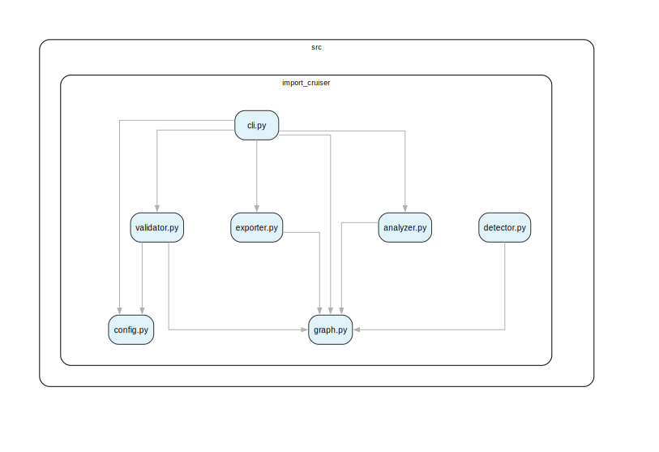

# import-cruiser

[](https://pypi.org/project/import-cruiser/)
[](https://pypi.org/project/import-cruiser/)
[](https://github.com/kevin91nl/import-cruiser/actions/workflows/workflow.yml)
[](#license)
[](#development)

**Analyze, validate, and visualize Python import dependencies.**

`import-cruiser` is a CLI tool for Python projects inspired by [dependency-cruiser](https://github.com/sverweij/dependency-cruiser). It parses Python `import` statements, builds a dependency graph, detects circular dependencies, validates the graph against configurable rules, and can export the results as JSON or DOT (Graphviz) format.

---

## Features

- 🔍 **Parse** all Python imports in a project directory
- 🔄 **Detect** circular dependencies automatically
- ✅ **Validate** dependencies against user-defined JSON rules
- 📊 **Export** dependency graphs as JSON or DOT/Graphviz
- 🖥️ **CLI** with three subcommands: `analyze`, `validate`, `export`

---

## Project self-graph (SVG)

Current dependency graph of `src/import_cruiser` (generated by `import-cruiser` itself):



---

## Installation

### With pip

```bash
pip install import-cruiser
```

### From source (with [Poetry](https://python-poetry.org/))

```bash
git clone https://github.com/kevin91nl/import-cruiser.git
cd import-cruiser
poetry install
```

---

## CLI Usage

### Quick start: generate graph/matrix outputs

Use this when you want a graph fast, without setting up rules first.

```bash
# 1) Install tool
pip install import-cruiser

# 2) From your repository root, export an interactive HTML graph
import-cruiser export . --format html --output deps.html

# 3) Export SVG directly
import-cruiser export . --format svg --output deps.svg

# 4) (Optional) Export DOT too, for custom Graphviz rendering
import-cruiser export . --format dot --output deps.dot

# 5) (Optional) Export dependency matrix as interactive HTML (great for big graphs)
import-cruiser export . --format matrix-html --output deps-matrix.html

# 6) (Optional) Export dependency matrix as JSON
import-cruiser export . --format matrix-json --output deps-matrix.json
```

Useful filters for larger repos:

```bash
# Focus on src/ and skip tests
import-cruiser export . --format html --include-path '^src/' --exclude-path '/tests/' --output deps-src.html

# Focus on a package/module prefix
import-cruiser export . --format svg --include '^myapp\.' --output deps-myapp.svg
```

Tip: Graph HTML is best for visual exploration (hover/pan/zoom). Matrix HTML is often better for very large graphs.

### CI usage (GitHub Actions)

```yaml
name: dependency-graph

on:
  workflow_dispatch:
  pull_request:

jobs:
  graph:
    runs-on: ubuntu-latest
    steps:
      - uses: actions/checkout@v4
      - uses: actions/setup-python@v5
        with:
          python-version: '3.11'
      - run: pip install import-cruiser
      - run: import-cruiser export . --format html --output deps.html
      - run: import-cruiser export . --format svg --output deps.svg
      - uses: actions/upload-artifact@v4
        with:
          name: dependency-graph
          path: |
            deps.html
            deps.svg
```

### Command overview

```
import-cruiser [OPTIONS] COMMAND [ARGS]...

Commands:
  analyze   Analyze imports and output results.
  export    Export the dependency graph.
  validate  Validate dependencies against rules.
```

### `analyze`

Scan a Python project and output a JSON or DOT dependency report.

```bash
# JSON report (default)
import-cruiser analyze ./myproject

# DOT format for Graphviz
import-cruiser analyze ./myproject --format dot

# Write to file
import-cruiser analyze ./myproject --output report.json
```

**JSON output structure:**

```json
{
  "summary": {
    "modules": 12,
    "dependencies": 18,
    "cycles": 0,
    "violations": 0
  },
  "modules": [...],
  "dependencies": [...],
  "cycles": [],
  "violations": []
}
```

### `validate`

Validate dependencies against rules defined in a JSON configuration file.

```bash
import-cruiser validate ./myproject --config import-cruiser.json

# Exit non-zero if there are any violations (useful in CI)
import-cruiser validate ./myproject --config import-cruiser.json --strict

# Emit linter-style output for editor/CI integrations
import-cruiser validate ./myproject --config import-cruiser.json --output-format flake8
import-cruiser validate ./myproject --config import-cruiser.json --output-format pylint
import-cruiser validate ./myproject --config import-cruiser.json --output-format github
```

#### Linter integration output modes

`validate` supports multiple output formats via `--output-format`:

- `json` (default): full graph + violations + cycles
- `flake8`: `path:line:col: CODE message`
- `pylint`: `path:line: [CODE] message`
- `github`: GitHub Actions annotations (`::error file=...::...`)

This makes it easy to plug `import-cruiser` into common linting pipelines.
In practice, the most-used Python lint tools are typically Ruff, Flake8, and Pylint.
For those stacks, `flake8`/`pylint` output modes are editor-friendly, and `github`
is ideal for GitHub Actions logs.

### `export`

Export the dependency graph to DOT format (compatible with [Graphviz](https://graphviz.org/)).

```bash
import-cruiser export ./myproject --output graph.dot

# Render with Graphviz
dot -Tsvg graph.dot -o graph.svg
```

---

## Configuration

Create a `import-cruiser.json` file to define dependency rules:

```json
{
  "rules": [
    {
      "name": "no-circular",
      "severity": "error",
      "from": { "path": "myapp\\.ui" },
      "to":   { "path": "myapp\\.data" },
      "allow": false
    },
    {
      "name": "allow-utils",
      "severity": "warn",
      "from": {},
      "to": { "path": "myapp\\.utils" },
      "allow": true
    }
  ],
  "options": {
    "include_external": false
  }
}
```

### Rule schema

| Field      | Type    | Required | Description                                         |
|------------|---------|----------|-----------------------------------------------------|
| `name`     | string  | ✅        | Unique rule identifier                              |
| `severity` | string  | ✅        | `"error"`, `"warn"`, or `"info"`                    |
| `from`     | object  | ✅        | Source module pattern (see *Pattern object* below)  |
| `to`       | object  | ✅        | Target module pattern (see *Pattern object* below)  |
| `allow`    | boolean | ❌        | `true` (default) = allowed; `false` = forbidden     |

### Pattern object

| Field  | Type   | Description                                          |
|--------|--------|------------------------------------------------------|
| `path` | string | Regular expression matched against the module name   |

An empty pattern object `{}` matches **all** modules.

---

## Examples

### Detect circular dependencies

```bash
import-cruiser analyze ./myproject
# Check the "cycles" key in the JSON output
```

### Enforce layered architecture

```json
{
  "rules": [
    {
      "name": "no-data-to-ui",
      "severity": "error",
      "from": { "path": "\\.data" },
      "to":   { "path": "\\.ui" },
      "allow": false
    }
  ]
}
```

```bash
import-cruiser validate ./myproject --config import-cruiser.json --strict
```

### Visualize dependencies

```bash
import-cruiser export ./myproject --output deps.dot
dot -Tpng deps.dot -o deps.png
open deps.png
```

---

## Development

```bash
# Install dev dependencies
poetry install

# Run tests
poetry run pytest

# Run tests with coverage
poetry run pytest --cov
```

### Architecture enforcement (pre-commit)

This repository uses `import-cruiser` itself in pre-commit to enforce dependency boundaries:

- Config file: `import-cruiser.json`
- Hook: `import-cruiser-architecture`
- Command:
  `PYTHONPATH=src python3 -m import_cruiser.cli validate src --config import-cruiser.json --strict --output-format pylint`

This gives linter-friendly output and fails commits when architectural rules are violated.

---

## License

MIT
